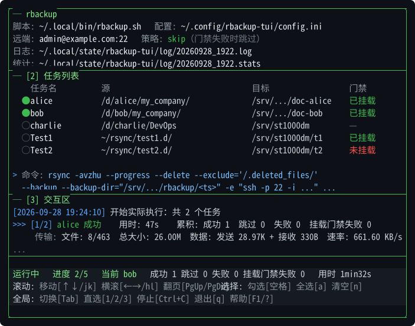

# rbackup-tui

rbackup.sh 的终端用户界面（TUI），用于管理和执行多任务 rsync 远程备份。

- 语言: Go
- TUI 框架: tview + tcell
- 后端: rbackup.sh
- 平台: Linux、Windows (MSYS2)

---

## 目录

- [功能](#功能)
- [界面说明](#界面说明)
  - [布局尺寸](#布局尺寸)
  - [焦点区（3 个）](#焦点区3-个)
  - [状态栏（3 行）](#状态栏3-行)
  - [顶部信息](#顶部信息)
- [安装](#安装)
  - [方式一：懒人模式（不需要源码，不需要 Go）](#方式一懒人模式不需要源码不需要-go)
  - [方式二：git clone 模式（不需要 Go）](#方式二git-clone-模式不需要-go)
  - [方式三：手动模式（源码 + Go，自己编译）](#方式三手动模式源码--go自己编译)
  - [卸载](#卸载)
  - [手动解压（不想用安装器）](#手动解压不想用安装器)
- [配置](#配置)
  - [全局配置](#全局配置)
  - [任务配置](#任务配置)
  - [关于 --chown](#关于---chown)
  - [关于时间戳](#关于时间戳)
  - [示例配置一：明文源 → 明文挂载点](#示例配置一明文源--明文挂载点)
  - [示例配置二：密文源 → 密文目录](#示例配置二密文源--密文目录)
  - [两份示例的对比](#两份示例的对比)
  - [使用示例配置](#使用示例配置)
- [使用](#使用)
  - [启动](#启动)
  - [命令行参数](#命令行参数)
  - [脚本路径查找顺序](#脚本路径查找顺序)
  - [典型流程](#典型流程)
- [快捷键](#快捷键)
  - [全局](#全局)
  - [焦点 1：信息区（header）](#焦点-1信息区header)
  - [焦点 2：任务区（table + 命令区）](#焦点-2任务区table--命令区)
  - [焦点 3：交互区（interact）](#焦点-3交互区interact)
  - [空闲状态（无运行、无确认）](#空闲状态无运行无确认)
  - [运行中（任何焦点）](#运行中任何焦点)
  - [危险确认中（交互区焦点）](#危险确认中交互区焦点)
- [挂载门禁](#挂载门禁)
  - [语义](#语义)
  - [require_mounted](#require_mounted)
  - [require_unmounted](#require_unmounted)
  - [两者互斥](#两者互斥)
  - [软链接挂载点](#软链接挂载点)
- [统计与日志](#统计与日志)
  - [文件位置](#文件位置)
  - [统计文件格式](#统计文件格式)
  - [用命令行读取统计](#用命令行读取统计)
  - [日志与 TUI 的关系](#日志与-tui-的关系)
  - [运行时长与数据](#运行时长与数据)
  - [分隔线](#分隔线)
  - [退出码](#退出码)
- [常见问题排查](#常见问题排查)
  - [挂载检查误报"未挂载"](#挂载检查误报未挂载)
  - [rsync 报"failed to set times"](#rsync-报failed-to-set-times)
  - [rsync 报"You can only specify a user-affecting --chown once"](#rsync-报you-can-only-specify-a-user-affecting---chown-once)
  - [rsync 报"Permission denied (13)"](#rsync-报permission-denied-13)
  - [日志里中文显示为 \#345\#267\#245](#日志里中文显示为-345267245)
- [构建](#构建)
  - [本地平台](#本地平台)
  - [交叉编译](#交叉编译)
  - [产物位置](#产物位置)
  - [版本注入](#版本注入)
- [打包与发布](#打包与发布)
  - [打包](#打包)
  - [发布到 GitHub Release](#发布到-github-release)
  - [本地打包（不上传）](#本地打包不上传)
  - [其他发布命令](#其他发布命令)
  - [参数](#参数)
- [环境变量](#环境变量)
- [常见问题](#常见问题)
  - [F1 无反应？](#f1-无反应)
  - [按 F1 或 ? 后帮助浮层出现但按键无响应？](#按-f1-或--后帮助浮层出现但按键无响应)
  - [Windows 下按键重复触发？](#windows-下按键重复触发)
  - [Windows 下 ESC 无法退出？](#windows-下-esc-无法退出)
  - [Linux 下 rbackup-tui 找不到 bash？](#linux-下-rbackup-tui-找不到-bash)
  - [rsync 输出没显示？](#rsync-输出没显示)
  - [日志目录不可写？](#日志目录不可写)
  - [如何只做挂载检查？](#如何只做挂载检查)
  - [危险确认时怎么快速跳过全部？](#危险确认时怎么快速跳过全部)
  - [如何强制退出？](#如何强制退出)
  - [顶部日志和统计路径显示为相对路径？](#顶部日志和统计路径显示为相对路径)
  - [统计文件去哪了？](#统计文件去哪了)
  - [状态栏按键提示方括号 `[a]` 显示不出来？](#状态栏按键提示方括号-a-显示不出来)
  - [按 Enter / d 后 TUI 卡死？](#按-enter--d-后-tui-卡死)
  - [命令太长显示不全？](#命令太长显示不全)
  - [日志行太长看不全？](#日志行太长看不全)
  - [想看终端首行/末行？](#想看终端首行末行)
- [文件结构](#文件结构)
- [作者](#作者)
- [许可证](#许可证)

---

## 功能

- 多任务管理：读取 config.ini，列出全部任务
- 批量选择：空格 / a / n 选择任务
- 运行 / 预览：Enter 运行，d 预演（dry-run）
- 危险操作二次确认：--delete、--remove-source-files 逐个确认，支持 y/n/a/s
- 挂载门禁：支持 require_mounted / require_unmounted
- 软链接挂载点兼容：用 realpath 解析路径后再比对
- 实时日志：rsync 输出实时滚动，可暂停、翻页
- 累积统计：成功 / 跳过 / 失败 / 挂载门禁失败
- 时长统计：每个任务用时 + 总用时（分钟/秒）
- 数据统计：文件数、总大小、发送/接收字节、平均速率
- 独立统计文件：与日志同目录，同名不同后缀（.stats）
- 错误摘要：失败任务自动提取错误行
- 等效命令：命令区实时显示将要执行的 rsync 命令（支持横滚）
- 三焦点区：信息区 / 任务区 / 交互区，Tab 循环切换
- 三行状态栏：状态 / 当前焦点按键 / 全局按键
- 帮助浮层：F1 或 ?
- 版本信息：编译时通过 -ldflags 注入 git 版本

---

## 界面说明



上图由 `tools/gen-ui-preview.py` 生成（矢量图，可随界面调整重新生成）。
终端高度 ≥ 31 行时完整显示；下面折叠块是同一布局的等宽纯文本版。

<details>
<summary>纯文本版（终端 / 离线阅读）</summary>

```text
┌─ rbackup ─────────────────────────────────────────────────────────────────────────────┐
│脚本: ~/.local/bin/rbackup.sh   配置: ~/.config/rbackup-tui/config.ini                  │
│远端: admin@example.com:22   策略: skip（门禁失败时跳过）                               │
│日志: ~/.local/state/rbackup-tui/log/20260928_1922.log                                  │
│统计: ~/.local/state/rbackup-tui/log/20260928_1922.stats                                │
├─ [2] 任务列表 ────────────────────────────────────────────────────────────────────────┤
│    任务名          源                                目标                  门禁        │
│  ● alice           /d/alice/my_company/              /srv/.../doc-alice    已挂载      │
│  ● bob             /d/bob/my_company/                /srv/.../doc-bob      已挂载      │
│  ○ charlie         /d/charlie/DevOps                 /srv/st1000dm         —           │
│  ○ Test1           ~/rsync/test1.d/                  /srv/st1000dm/t1      已挂载      │
│  ○ Test2           ~/rsync/test2.d/                  /srv/st1000dm/t2      未挂载      │
│                                                                                        │
│> 命令: rsync -avzhu --progress --delete --exclude='/.deleted_files/'                   │
│  --backup --backup-dir="/srv/.../rbackup/<ts>" -e "ssh -p 22 -i ..." ...               │
├─ [3] 交互区 ──────────────────────────────────────────────────────────────────────────┤
│[2026-09-28 19:24:10] 开始实际执行：共 2 个任务                                         │
│>>> [1/2] alice 成功    用时: 47s    累积: 成功 1  跳过 0  失败 0  挂载门禁失败 0       │
│     传输: 文件: 8/463  总大小: 26.00M  数据: 发送 28.97K + 接收 330B  速率: 661.60 KB/s│
│...                                                                                     │
├───────────────────────────────────────────────────────────────────────────────────────┤
│运行中   进度 2/5   当前 bob   成功 1 跳过 0 失败 0 挂载门禁失败 0   用时 1min32s       │
│滚动: 移动[↑↓/jk] 横滚[←→/hl] 翻页[PgUp/PgDn]  选择: 勾选[空格] 全选[a] 清空[n]         │
│全局: 切换[Tab] 直选[1/2/3] 停止[Ctrl+C] 退出[q] 帮助[F1/?]                             │
└────────────────────────────────────────────────────────────────────────────────────────┘
```

</details>

### 布局尺寸

    header              4 行 (边框 2 + 内容 2)
    tableArea           权重 3 (边框 2 + 表格 + 命令区 2)
    interact            权重 2 (边框 2 + 日志)
    状态栏              3 行
    合计                约 31 行

### 焦点区（3 个）

| 编号 | 区域 | 边框色（焦点时） | 说明 |
|---|---|---|---|
| 1 | 信息区 (header) | 绿色 | 顶部两行信息，支持横滚 |
| 2 | 任务区 (table) | 绿色 | 任务表格 + 命令区 |
| 3 | 交互区 (interact) | 绿色 | 实时日志，支持横滚 |

切换方式：`Tab` 循环 1→2→3→1；`1` / `2` / `3` 直选。

### 状态栏（3 行）

- **第 1 行**：状态 + 进度 + 累积统计（危险确认时红/黄闪烁）
- **第 2 行**：当前焦点区的按键提示（分类显示）
- **第 3 行**：全局按键（固定显示）

### 顶部信息

- 第一行：脚本路径、配置文件、挂载策略（含中文描述）
- 第二行：远端主机、日志文件、统计文件

所有路径自动将 `$HOME` 前缀缩写为 `~`。

---

## 安装

三种方式，按你手上有什么选一种。

### 方式一：懒人模式（不需要源码，不需要 Go）

一条命令，自动识别系统与架构，从 GitHub Releases 下载预编译包并校验 SHA256：

    # 用户级（无需 sudo）
    curl -fsSL https://github.com/lockejet/rbackup-tui/releases/latest/download/install.sh | bash

    # 系统级（装到 /usr/local/bin，需要 sudo）
    curl -fsSL https://github.com/lockejet/rbackup-tui/releases/latest/download/install.sh | sudo bash -s -- --system

常用参数：

| 参数 | 说明 |
|---|---|
| `--system` | 系统级安装 |
| `--prefix DIR` | 自定义安装前缀 |
| `--version vX.Y.Z` | 指定版本（默认 latest） |
| `--from FILE` | 用本地预编译包安装（离线） |
| `--uninstall` | 卸载（保留配置与日志） |
| `--dry-run` | 只打印将要做什么 |
| `--require-checksum` | 缺少 SHA256SUMS 时直接失败 |

安装布局：

| | 用户级 | 系统级 |
|---|---|---|
| 主程序 | `~/.local/bin/rbackup-tui` | `/usr/local/bin/rbackup-tui` |
| 后端脚本 | `~/.local/bin/rbackup.sh` | `/usr/local/bin/rbackup.sh` |
| 配置 | `~/.config/rbackup-tui/config.ini` | 仍按调用 sudo 的那个用户：`~/.config/rbackup-tui/config.ini` |
| 日志 | 配置里的 `LOG_DIR`；不可写时回退 `~/.local/state/rbackup-tui/log` | 同左 |
| 样例 / 文档 | `~/.local/share/rbackup-tui/` | `/usr/local/share/rbackup-tui/` |

各路径遵循 XDG 规范：`XDG_CONFIG_HOME`（Windows 为 `%AppData%`）、
`XDG_STATE_HOME`、`XDG_DATA_HOME` 设置后按设置生效。

Windows（MSYS2 / Git Bash）下用户级安装到 `~/.local/bin`；`--system` 装到
`%LOCALAPPDATA%/Programs/rbackup-tui`（无需管理员权限）。

### 方式二：git clone 模式（不需要 Go）

    git clone https://github.com/lockejet/rbackup-tui.git
    cd rbackup-tui

    make install-prebuilt                 # 用户级，装当前检出对应的版本
    make install-prebuilt SYSTEM=1        # 系统级
    make install-prebuilt VERSION=vX.Y.Z  # 指定版本
    make install-prebuilt FROM=dist/rbackup-tui-vX.Y.Z-linux-amd64.tar.gz   # 离线

全程只下载预编译包，不会调用 `go`。

### 方式三：手动模式（源码 + Go，自己编译）

依赖：Go 1.27+（见 `go.mod`）

    git clone https://github.com/lockejet/rbackup-tui.git
    cd rbackup-tui

    make install            # 用户级：编译并装到 ~/.local/bin
    make install-system     # 系统级：编译后 sudo 装到 /usr/local/bin
    make build              # 只编译不安装
    make package            # 打三平台发布包

### 卸载

    make uninstall                                          # 在克隆目录里执行
    curl -fsSL .../install.sh | bash -s -- --uninstall       # 预编译安装的

只删除程序文件（含安装清单里记录的所有文件），保留 `~/.config/rbackup-tui/` 下的配置与日志。

### 手动解压（不想用安装器）

从 GitHub Releases 下载对应平台的压缩包，解压后目录结构：

    rbackup-tui-linux-amd64/
    ├── rbackup-tui
    ├── rbackup.sh
    ├── config1.ini.example
    ├── config2.ini.example
    ├── README.md
    └── LICENSE

复制示例配置后即可运行：

    cp config2.ini.example config2.ini
    vim config2.ini
    ./rbackup-tui -c config2.ini -s rbackup.sh

`rbackup.sh` 与二进制同目录时，`-s` 可以省略。

---

## 配置

rbackup-tui 与 rbackup.sh 共用 config.ini，格式一致。

### 全局配置

| 键 | 说明 | 默认 |
|---|---|---|
| HOST | 远端主机 | localhost |
| SSH_PORT | SSH 端口 | 22 |
| SSH_USER | SSH 用户名 | admin |
| SSH_KEY | SSH 私钥路径 | ~/.ssh/id_ed25519 |
| LOG_DIR | 日志目录 | /var/log/rbackup |
| GLOBAL_OPTS | rsync 全局选项 | -avzhu --progress |
| RSYNC_PATH | 提权命令 | sudo rsync |
| DEFAULT_REMOVE_SOURCE | 源端删除默认值 | no |
| MOUNT_POLICY | 门禁失败策略 | skip |

MOUNT_POLICY 取值：

- skip：跳过，不算失败
- fail：记失败，影响退出码
- ignore：不检查

### 任务配置

    [task_example]
    src=/path/to/source/
    dst=/path/to/target/
    opts=--no-perms --chown=user:group --update
    delete=yes
    remove_source=no
    require_mounted=yes
    mount_point=/path/to/mount/point
    mount_fstype=fuse.gocryptfs

| 键 | 说明 |
|---|---|
| src | 本地源路径（~ 会展开） |
| dst | 远端目标路径 |
| opts | 任务级 rsync 附加选项 |
| delete | yes / no，启用回收站模式 |
| remove_source | yes / no，同步后删除源文件 |
| require_mounted | yes，要求 mount_point 已挂载 |
| require_unmounted | yes，要求 mount_point 未挂载 |
| mount_point | 要检查的挂载点（省略时默认取 dst） |
| mount_fstype | require_mounted 时的期望类型 |

兼容旧键：

- require_mount=yes 等价于 require_mounted=yes
- require_mount=no 等价于不检查
- mount_path 等价于 mount_point

推荐使用新键，但旧键依然有效。

### 关于 --chown

rsync 只允许 `--chown` 出现一次。可以放在：

- `GLOBAL_OPTS` 里（所有任务共用）
- 每个任务的 `opts` 里（任务各自控制）

不能两处都写，否则报错：

    rsync: You can only specify a user-affecting --chown once.

推荐放 `GLOBAL_OPTS`，任务 opts 里不再重复。

### 关于时间戳

加密文件系统（gocryptfs 等）挂载点常出现：

    rsync: [generator] failed to set times on "...": Operation not permitted (1)
    rsync error: some files/attrs were not transferred (see previous errors) (code 23)

原因是 rsync 尝试把源端 mtime 设置到目标，但被挂载点拒绝。

解决：在 `GLOBAL_OPTS` 里加 `--omit-dir-times`（跳过目录时间戳），如需跳过文件时间戳再加 `--no-times`。

| 选项 | 作用 |
|---|---|
| `--no-times` | 不设置文件的 mtime |
| `--omit-dir-times` | 不设置目录的 mtime |

推荐组合：

    GLOBAL_OPTS=-avzhu --progress --no-perms --omit-dir-times --chown=admin:users --update --delete-after

如果仍有零星 code 23 报错，不影响内容同步，可忽略。

### 示例配置一：明文源 → 明文挂载点

对应 `config1.ini.example`。源是明文目录，目标是已解密的 gocryptfs 挂载点，使用旧键 `require_mount` / `mount_path` 书写。

    # ============================================================
    # 全局配置
    # ============================================================
    HOST=example.com
    SSH_PORT=22
    SSH_KEY=~/.ssh/id_ed25519
    LOG_DIR=/var/log/rbackup
    GLOBAL_OPTS=-avzhu --progress --no-perms --omit-dir-times --chown=admin:users --update --delete-after
    RSYNC_PATH=sudo rsync
    DEFAULT_REMOVE_SOURCE=no

    # 挂载门禁策略: skip | fail | ignore
    MOUNT_POLICY=skip

    # ============================================================
    # 任务
    # ============================================================
    [task_alice]
    src=/d/alice/my_company/
    dst=/srv/st1000dm/Work/doc-alice
    opts=
    delete=yes
    remove_source=no
    require_mount=yes
    mount_path=/srv/st1000dm/Work
    mount_fstype=fuse.gocryptfs

    [task_bob]
    src=/d/bob/my_company/
    dst=/srv/st1000dm/Work/doc-bob
    opts=
    delete=yes
    remove_source=no
    require_mount=yes
    mount_path=/srv/st1000dm/Work
    mount_fstype=fuse.gocryptfs

    [task_charlie]
    src=/d/charlie/DevOps
    dst=/srv/st1000dm
    opts=
    delete=yes
    remove_source=no
    require_mount=no

    [task_Test1]
    src=~/rsync/test1.d/
    dst=/srv/st1000dm/test1.d
    delete=yes
    require_mount=yes
    mount_path=/srv/st1000dm/test1.d
    mount_fstype=fuse.gocryptfs

    [task_Test2]
    src=~/rsync/test2.d/
    dst=/srv/st1000dm/test2.d
    delete=yes
    require_mount=no
    mount_path=/srv/st1000dm/test2.d
    mount_fstype=fuse.gocryptfs

**特点**：

- 使用旧键 `require_mount` / `mount_path`（兼容写法）
- 门禁模式：`require_mounted`（目标必须是已挂载的明文挂载点）
- 源是明文，目标是已解密的 gocryptfs 挂载点

### 示例配置二：密文源 → 密文目录

对应 `config2.ini.example`。源是 gocryptfs 底层密文目录，目标是另一个 gocryptfs 底层密文目录，使用新键 `require_unmounted` / `mount_point` 书写。

    # ============================================================
    # 备份配置文件示例
    # 放置于脚本同目录下，或通过 --config 指定其他路径
    # ============================================================

    # 全局 SSH 参数
    HOST=example.com
    SSH_PORT=22
    SSH_KEY=~/.ssh/id_ed25519

    # 日志目录（自动生成 ${SCRIPT_NAME}_${DATE}.log 与 .stats）
    LOG_DIR=/var/log

    # 全局 rsync 默认选项（可被任务级 opts 追加覆盖）
    GLOBAL_OPTS=-avzhu --progress --omit-dir-times

    # 提权选项，需要命令行中用 --sudo 激活
    RSYNC_PATH=sudo rsync

    # ============================================================
    # 任务定义
    # ============================================================

    [task_Personal_Vault]
    src=/srv/st1000dm/Personal_Vault
    dst=/mnt/wd4000g
    opts=--size-only
    delete=yes

    [task_Study]
    src=/srv/st1000dm/Study
    dst=/mnt/wd4000g
    delete=yes

    [task_Life]
    src=/srv/st1000dm/Life
    dst=/mnt/wd4000g
    opts=-rtvh
    delete=yes

    [task_infra_secrets_cipher]
    src=/srv/st1000dm/.cipher.d/infra_secrets
    dst=/mnt/wd4000g/.cipher.d
    opts=-avh
    delete=yes
    require_unmounted=yes
    mount_point=/mnt/wd4000g/infra_secrets
    mount_fstype=fuse.gocryptfs

    [task_Work_Cipher]
    src=/srv/st1000dm/.cipher.d/Work
    dst=/mnt/wd4000g/.cipher.d
    opts=-avh
    delete=yes
    require_unmounted=yes
    mount_point=/mnt/wd4000g/Work
    mount_fstype=fuse.gocryptfs

**特点**：

- 使用新键 `require_unmounted` / `mount_point`
- 门禁模式：`require_unmounted`（目标明文挂载点必须未挂载）
- 源是密文，目标是 gocryptfs 底层密文目录
- 前三个任务（Personal_Vault、Study、Life）未加密，不设门禁

### 两份示例的对比

| 项 | 示例一（config1） | 示例二（config2） |
|---|---|---|
| 源 | 明文目录 | 密文目录 |
| 目标 | 明文挂载点 | 密文目录 |
| 门禁 | require_mount=yes（旧键） | require_unmounted=yes（新键） |
| 键风格 | 兼容旧键 | 推荐新键 |
| 典型任务 | task_alice、task_bob、task_charlie | task_Work_Cipher、task_infra_secrets_cipher |
| 门禁判定 | 目标必须已挂载 | 目标必须未挂载 |

### 使用示例配置

    cp config1.ini.example config1.ini
    vim config1.ini

    rbackup-tui -c config1.ini -s rbackup.sh

---

## 使用

### 启动

    # 默认读取 $XDG_CONFIG_HOME/rbackup-tui/config.ini（即 ~/.config/rbackup-tui/config.ini）
    rbackup-tui

    # 指定配置
    rbackup-tui -c ~/rbackup-tui/config-lnas.ini

    # 指定脚本
    rbackup-tui -c ~/rbackup-tui/config-lnas.ini -s ~/.local/bin/rbackup.sh

### 命令行参数

| 参数 | 说明 |
|---|---|
| -c, --config | 配置文件路径 |
| -s, --script | rbackup.sh 路径 |

### 脚本路径查找顺序

1. 命令行 `-s` 指定
2. 环境变量 `RBACKUP_SCRIPT`
3. 二进制同目录（安装器与发布包的场景：`rbackup.sh` 与主程序并排）
4. `$HOME/rbackup-tui/rbackup.sh`
5. `$HOME/rbackup/rbackup.sh`（旧布局，保持兼容）
6. `$HOME/.local/bin/rbackup`
7. `$HOME/.local/bin/rbackup.sh`
8. `PATH` 中的 `rbackup.sh` / `rbackup`

配置路径查找顺序：`-c` / `--config` → `RBACKUP_CONFIG` →
`$XDG_CONFIG_HOME/rbackup-tui/config.ini`（默认 `~/.config/rbackup-tui/config.ini`）→
`$HOME/rbackup-tui/config.ini`（过渡兼容）→ `$HOME/rbackup/config.ini`（更旧布局）。

全找不到时报错退出，提示用 `-s` 或 `RBACKUP_SCRIPT` 指定。

### 典型流程

1. 启动 TUI
2. 空格选择要备份的任务
3. Enter 运行
4. 如有危险操作，逐个确认（y/n/a/s）
5. 观察实时日志（焦点自动切到交互区）
6. 完成后按 Tab 切换焦点查看各区

---

## 快捷键

### 全局

| 键 | 功能 |
|---|---|
| F1 / ? | 显示 / 关闭帮助 |
| Tab | 循环切焦点 (1→2→3→1) |
| 1 / 2 / 3 | 直选焦点（信息 / 任务 / 交互） |
| Ctrl+D ×3 | 强制退出程序 |

### 焦点 1：信息区（header）

| 键 | 功能 |
|---|---|
| ← → / h l | 横向滚动 |
| ↑ ↓ / j k | 纵向滚动（保留） |
| PgUp / PgDn | 翻页 |
| g / G / Home / End | 纵向首行 / 末行 |
| 0 / $ | 横向行首 / 行尾 |

### 焦点 2：任务区（table + 命令区）

| 键 | 功能 |
|---|---|
| ↑ ↓ / j k | 移动光标 |
| ← → / h l | 命令区横向滚动 |
| PgUp / PgDn | 翻页 |
| g / G / Home / End | 首行 / 末行 |
| 0 / $ | 命令区行首 / 行尾 |
| 空格 | 选择 / 取消选择 |
| a / n | 全选 / 全不选 |
| Enter | 运行选中任务 |
| d | 预览（dry-run） |
| m | 挂载检查 |
| r | 刷新配置 |

### 焦点 3：交互区（interact）

| 键 | 功能 |
|---|---|
| ↑ ↓ / j k | 滚动日志 |
| ← → / h l | 横向滚动 |
| PgUp / PgDn | 翻页 |
| g / G / Home / End | 纵向首行 / 末行 |
| 0 / $ | 横向行首 / 行尾 |
| p / 空格 | 暂停 / 继续自动滚动 |
| Esc | 切回任务区焦点 |

### 空闲状态（无运行、无确认）

| 键 | 功能 |
|---|---|
| q | 退出程序 |
| Esc | 退出程序 / 交互区焦点切回任务区 |
| Ctrl+C | 退出程序 |

### 运行中（任何焦点）

| 键 | 功能 |
|---|---|
| Ctrl+C | 停止任务 |
| p / 空格 | 暂停 / 继续自动滚动 |
| ↑↓←→ / j k h l | 滚动 |
| PgUp / PgDn | 翻页 |
| Tab | 切焦点 |

### 危险确认中（交互区焦点）

| 键 | 功能 |
|---|---|
| y | 确认当前任务 |
| n | 跳过当前任务 |
| a | 全部确认 |
| s | 全部跳过 |
| Ctrl+C | 全部跳过 |
| ↑↓←→ / PgUp / PgDn | 滚动确认详情 |

---

## 挂载门禁

### 语义

| 场景 | 源 | 目标 | 门禁 |
|---|---|---|---|
| 明文 → 明文挂载点 | 明文 | gocryptfs 挂载点 | require_mounted |
| 密文 → 密文目录 | 密文 | gocryptfs 底层 | require_unmounted |

### require_mounted

用于同步明文到已解密的挂载点。

- 目标必须已挂载，且类型匹配
- 未挂载 → 拒绝（避免明文写入未加密磁盘）

配置示例：

    require_mount=yes
    mount_path=/srv/st1000dm/Work
    mount_fstype=fuse.gocryptfs

或新键写法：

    require_mounted=yes
    mount_point=/srv/st1000dm/Work
    mount_fstype=fuse.gocryptfs

### require_unmounted

用于同步密文到 gocryptfs 底层。

- 目标必须未挂载
- 已挂载 → 拒绝（gocryptfs 正在使用底层密文，写入会破坏一致性）

配置示例：

    require_unmounted=yes
    mount_point=/mnt/wd4000g/Work
    mount_fstype=fuse.gocryptfs

### 两者互斥

同时为 yes 会报错退出（退出码 2）。

### 软链接挂载点

部分系统（如 OpenMediaVault）用软链接组织存储：

    /srv/st1000dm -> /srv/dev-disk-by-id-ata-xxx-part1

直接比较字符串会误判"未挂载"。rbackup.sh 在远端一次 SSH 完成：

1. `realpath -m <mount_point>` 解析软链接
2. `findmnt -T <真实路径>` 查询挂载信息
3. `realpath -m <TARGET>` 再解析一遍
4. 比较两个真实路径

这样即使 mount_point 和 findmnt 返回的路径写法不同，只要指向同一位置，就判定"已挂载"。

---

## 统计与日志

### 文件位置

日志和统计文件生成在同一个目录，文件名前缀相同，后缀不同：

    ~/rbackup/log/rbackup_20260928_1922.log      完整日志
    ~/rbackup/log/rbackup_20260928_1922.stats    统计报告

文件名带时分（YYYYMMDD_HHMM），同一分钟内多次运行会覆盖同名文件。

如果 `LOG_DIR` 不可写，两者一起回退到脚本所在目录的 `log/`。

### 统计文件格式

key=value 纯文本，分组结构。全部为展示字段（英文单位），无原始字段。

单任务块：

    [task]
    name=infra_secrets_cipher
    result=success
    duration=47s
    files=8 / 463
    total_size=26.00M
    data=sent 28.97K + received 330B
    rsync=45s
    list=3s
    rate=661.60 KB/s
    prep=2s

汇总块（文件末尾）：

    [summary]
    tasks=success 2 / skipped 0 / failed 0 / mount_failed 0
    duration=3min15s
    files=16 / 926
    total_size=52.50M
    data=sent 58.25K + received 660B
    rate=305.60 KB/s
    rsync=1min36s
    list=6s

**字段说明**：

| 字段 | 含义 |
|---|---|
| result | success / skipped / failed / mount_failed / preview |
| duration | 任务总耗时（含准备） |
| files | 实际传输文件数 / 扫描文件总数 |
| total_size | 源端文件总大小 |
| data | 发送 + 接收字节 |
| rsync | rsync 执行时间 |
| list | rsync 内部文件列表生成时间 |
| rate | 平均速率（按 rsync 耗时计算） |
| prep | 准备阶段耗时（挂载检查、目录创建等） |

**时间格式**：`47s` 或 `3min15s`
**字节格式**：`B` / `K` / `M` / `G`（2 位小数）
**速率格式**：`X.XX KB/s`

### 用命令行读取统计

    # 查看所有任务名
    grep '^name=' ~/rbackup/log/rbackup_*.stats

    # 查看汇总
    grep -A 20 '\[summary\]' ~/rbackup/log/rbackup_*.stats

    # 只取失败任务
    awk '/^\[task\]/{n=""} /^name=/{n=$0} /^result=failed/{print n}' \
        ~/rbackup/log/rbackup_*.stats

### 日志与 TUI 的关系

- TUI 只显示 `rbackup.sh` 的实时输出，不解析日志文件
- 统计通过 `rbackup.sh` 输出的单行 `[STATS]` 协议传递给 TUI
- TUI 拦截 `[STATS]` 行，不显示在日志区
- `[STATS]` 行仍会写入日志文件，供命令行工具读取

### 运行时长与数据

TUI 里每个任务完成后显示 **2 行**详情：

    >>> [1/5] infra_secrets_cipher 成功    用时: 47s    累积: 成功 1  跳过 0  失败 0  挂载门禁失败 0
          传输: 文件: 8/463  总大小: 26.00M  数据: 发送 28.97K + 接收 330B  速率: 661.60 KB/s  列表: 3s  执行: 45s

最终汇总包含 **3 行**（含分隔线）：

    --------------------------------------------------------------------------------
    [2026-09-28 19:24:10] 全部任务完成（总用时 3min15s）
      成功 2: infra_secrets_cipher Work_Cipher  跳过 0  失败 0  挂载门禁失败 0
      传输: 文件: 16/926  总大小: 52.50M  数据: 发送 58.25K + 接收 660B  速率: 305.60 KB/s  列表: 6s  执行: 1min36s
    --------------------------------------------------------------------------------

rbackup.sh 日志文件中的对应输出格式一致（字段顺序：文件 → 总大小 → 数据 → 速率 → 列表 → 执行）。

### 分隔线

- **rbackup.sh 输出**：80 个短横线（`-`），用于脚本启动、任务边界、rsync 阶段分隔
- **TUI 危险确认**：80 个短横线，上下包裹确认详情
- **TUI 汇总**：80 个短横线，上下包裹汇总块

### 退出码

| 退出码 | 含义 |
|---|---|
| 0 | 全部成功（含跳过） |
| 1 | 有任务失败 |
| 2 | 参数 / 配置错误 |
| 3 | 有任务因挂载门禁失败 |

---

## 常见问题排查

### 挂载检查误报"未挂载"

**现象**：手动执行 `findmnt -T <path>` 返回正确结果，但 rbackup.sh 报"未挂载"。

**原因**：路径中含软链接，`findmnt` 返回真实路径，与配置的 mount_point 字符串不相等。

**验证**：

    ssh -p <PORT> -i <KEY> <USER>@<HOST> \
        'realpath -m /your/mount/point && \
         findmnt -rn -T $(realpath -m /your/mount/point) -o TARGET,FSTYPE'

如果 TARGET 和 realpath 输出不同，说明是软链接问题。

**解决**：rbackup.sh 已内置 realpath 解析，无需额外处理。如果仍报错，检查 rbackup.sh 是否为最新版本。

### rsync 报"failed to set times"

**现象**：

    rsync: [generator] failed to set times on "...": Operation not permitted (1)
    rsync error: some files/attrs were not transferred (see previous errors) (code 23)

**原因**：加密挂载点拒绝设置 mtime。

**解决**：GLOBAL_OPTS 加 `--omit-dir-times`（目录），必要时再加 `--no-times`（文件）：

    GLOBAL_OPTS=-avzhu --progress --no-perms --omit-dir-times --chown=admin:users --update --delete-after

### rsync 报"You can only specify a user-affecting --chown once"

**原因**：`--chown` 在 GLOBAL_OPTS 和任务 opts 里各写了一次。

**解决**：只保留一处。检查方法：

    grep -n "\-\-chown" config1.ini

### rsync 报"Permission denied (13)"

**现象**：

    rsync: [sender] send_files failed to open "...": Permission denied (13)

**原因**：运行 rbackup.sh 的用户没有权限读取源端文件。

**解决**：

- 如果是加密挂载点，先卸载 gocryptfs，改密文文件属主和权限：

      sudo chown -R <user>:<group> /path/to/cipher
      sudo chmod -R u+rwX,g+rX /path/to/cipher

- 或者用 `--sudo` 让远端 rsync 提权（仅远端，本地仍需读权限）

### 日志里中文显示为 \#345\#267\#245

**原因**：rsync 在非 UTF-8 locale 下转义非 ASCII 字符。

**解决**：

    export LC_ALL=C.UTF-8
    export LANG=C.UTF-8

或在 rsync 选项里加 `--8-bit-output`。

不影响同步，只是日志可读性问题。

---

## 构建

### 本地平台

    make build

### 交叉编译

    make build-win              # Windows exe
    make build-linux            # Linux amd64
    make build-linux-arm64      # Linux arm64
    make build-all              # 全部

### 产物位置

    bin/
    ├── windows/rbackup-tui.exe
    └── linux/rbackup-tui

### 版本注入

Makefile 会自动注入版本：

    BUILD_VERSION := $(git describe --tags --always --dirty)
    VERSION       := $(git describe --tags --abbrev=0)

- `BUILD_VERSION`：含 commit hash 和 dirty 标记，用于二进制内部（帮助浮层显示）
- `VERSION`：纯 tag，用于文件名和 Release 版本号

打 tag 后版本号显示为 `vX.Y.Z`，未打 tag 显示 `dev`。

---

## 打包与发布

### 打包

    make package

生成三个压缩包到 `dist/`：

    rbackup-tui-vX.Y.Z-linux-amd64.tar.gz
    rbackup-tui-vX.Y.Z-linux-arm64.tar.gz
    rbackup-tui-vX.Y.Z-windows-amd64.zip

每个压缩包内含：

    rbackup-tui-<平台>/
    ├── rbackup-tui (或 .exe)
    ├── rbackup.sh
    ├── config1.ini.example
    ├── config2.ini.example
    ├── README.md
    └── LICENSE

顶层有子目录，不会污染用户当前目录。`rbackup.sh` 与二进制同目录，用户运行时自动找到。

### 发布到 GitHub Release

发布由 GitHub Actions 自动完成：**推送 tag 即触发**。

    # 1. 提交并推送代码
    git add -A
    git commit -m "feat: ..."
    git push

    # 2. 打 tag 并推送（用 -a 创建注释 tag）
    git tag -a vX.Y.Z -m "vX.Y.Z: ..."
    git push origin vX.Y.Z

    # 3. 观察 workflow
    gh run watch

`.github/workflows/release.yml` 会：

1. 校验 tag 与 `git describe` 一致（浅克隆缺 tag 会直接失败）
2. 编译 linux/amd64、linux/arm64、windows/amd64 三个平台
3. 打包成压缩包，生成 `SHA256SUMS`
4. 冒烟测试产物，复核校验和
5. 创建 Release（已存在则覆盖附件）

附件包含三个压缩包、`SHA256SUMS` 和 `install.sh`。Release 里的 `install.sh`
就是懒人模式入口，两者永远同版本。

    dist/
    ├── rbackup-tui-vX.Y.Z-linux-amd64.tar.gz
    ├── rbackup-tui-vX.Y.Z-linux-arm64.tar.gz
    ├── rbackup-tui-vX.Y.Z-windows-amd64.zip
    ├── install.sh
    ├── SHA256SUMS
    └── RELEASE_NOTES.md

### 本地打包（不上传）

    make release

等价于 `make package stage-release-extras checksums release-notes`：产物落在
`dist/`，**不会**创建或修改任何 Release，也不需要 gh。用于离线交付、内网分发
或发布前预演。

### 其他发布命令

    # 校验已发布资产（下载 + 比对 SHA256SUMS + bash -n install.sh）
    make verify-release VERSION=vX.Y.Z

    # 应急手工上传（Actions 不可用时）
    make release-upload VERSION=vX.Y.Z

    # 只生成 notes 文件查看
    make release-notes VERSION=vX.Y.Z

    # 删除 Release（保留 tag）
    make release-delete VERSION=vX.Y.Z

### 参数

| 变量 | 说明 |
|---|---|
| VERSION | 版本号，默认取 git 最近 tag |
| NOTES | notes 文件路径，默认 dist/RELEASE_NOTES.md |
| REPO | 仓库，默认从 git remote 解析 |
| EXPECT_TAG | CI 用：要求解析出的版本必须等于该 tag |

---

## 环境变量

| 变量 | 说明 | 默认 |
|---|---|---|
| RBACKUP_CONFIG | 配置文件路径 | $HOME/rbackup/config.ini |
| RBACKUP_SCRIPT | rbackup.sh 路径 | 自动查找 |
| RBACKUP_BASH | bash 可执行文件路径 | 自动查找 |
| RBACKUP_DEBUG_KEYS | 设为 1 输出按键调试日志 | — |

---

## 常见问题

### F1 无反应？

部分终端（gnome-terminal、konsole）把 F1 保留为帮助。使用 ? 代替。

### 按 F1 或 ? 后帮助浮层出现但按键无响应？

检查 RBACKUP_DEBUG_KEYS=1，按一次 F1 看 key.log。若无 Key=xxx 记录，说明按键被终端拦截。

### Windows 下按键重复触发？

MSYS2 mintty 会重复分发事件。代码内置 50ms 去重。

### Windows 下 ESC 无法退出？

MSYS2 + winpty 会吞掉 ESC。使用 q 或 Ctrl+C。

### Linux 下 rbackup-tui 找不到 bash？

设置 RBACKUP_BASH=/bin/bash，或在 config.ini 中确认 SSH_KEY 等路径正确。

### rsync 输出没显示？

先做挂载检查和远端目录检查，输出有几秒延迟。等待即可。

### 日志目录不可写？

rbackup.sh 会自动回退到脚本同目录的 log/。

### 如何只做挂载检查？

命令行 rbackup.sh --check-mount；TUI 中按 m。

### 危险确认时怎么快速跳过全部？

按 s（no to all）或 Ctrl+C。

### 如何强制退出？

1.5 秒内连按 3 次 Ctrl+D。

### 顶部日志和统计路径显示为相对路径？

已修复。如果仍出现，检查二进制是否为最新编译。

### 统计文件去哪了？

与日志同目录，同名不同后缀。TUI 顶部显示完整路径。

### 状态栏按键提示方括号 `[a]` 显示不出来？

已修复（改用 `tview.Escape`）。

### 按 Enter / d 后 TUI 卡死？

已修复（危险确认闪烁首次渲染改为异步）。

### 命令太长显示不全？

命令区固定 2 行，超长命令自动截断。用 `←→/hl` 横滚，`0/$` 跳到行首/行尾。

### 日志行太长看不全？

用 `←→/hl` 横滚，`0/$` 跳到行首/行尾。

### 想看终端首行/末行？

纵向用 `g/G`（同 `Home/End`），横向用 `0/$`。

---

## 文件结构

    rbackup-tui/
    ├── main.go                  TUI 主程序
    ├── config.go                配置解析
    ├── runner.go                执行 rbackup.sh
    ├── rbackup.sh               备份核心脚本
    ├── install.sh               懒人模式安装器（也作为 Release 资产发布）
    ├── go.mod
    ├── go.sum
    ├── Makefile
    ├── README.md
    ├── LICENSE
    ├── config1.ini.example      示例一：明文源 → 明文挂载点
    ├── config2.ini.example      示例二：密文源 → 密文目录
    ├── .github/workflows/       release.yml（tag 自动发布）、ci.yml
    ├── docs/                    文档（含 CLEAN-HISTORY.md 运维操作单）
    ├── integrations/lazyrsync/  lazyrsync 挂载门禁集成（可选，不打包）
    ├── bin/                     编译产物（不入库）
    ├── dist/                    发布包（不入库）
    └── .staging/                打包临时目录（不入库）

---

## 作者

Jet Locke

---

## 许可证

MIT License

Copyright (c) 2026 Jet Locke

详见同目录 LICENSE 文件。
